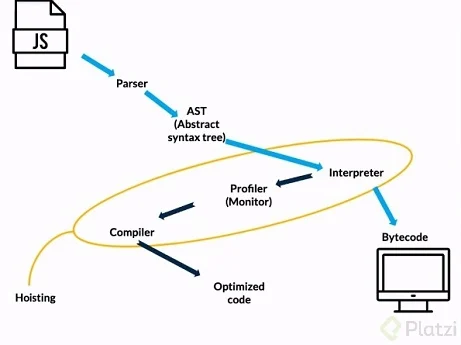

# Profundizando en el Engine

**Una vez que se ejecuta un archivo en el navegador, el motor de javascript genera un entorno global. El entorno global hace 3 cosas muy importantes:**

- **Genera un objeto global llamado window.**
- **Genera un contexto llamndo this. En contexto global this es igual a window.**
- **Ambiente de ejecucion.**

**Despues de generar el entorno global, comienza el contexto de ejeccucion donde corre el codigo de javascript utilizando un stack de tareas, apilandolas una por una, en el cual la ultima tarea añadida sera la primera en ejecutarse.**

**Una vez que el motor de javascript esta interactaundo con el navegador, realiza los siguientes procesos:**

### - Parser:
**Genera un parseo del documento completo medianrte palabras clave.**

### - AST:
**Se crea a partir de los nodos que genera el parser. Es una estructura de arbol que reprensenta tu codigo sintacticamente.**

### - Interprete:
**El interprete recorrer el ATS y genera Bytecode (lenguaje que entiende la maquina y no es binario) basado en la informacion que contiene. Sin embargo, si el interprete detecta que puede optimizar tu codigo no genera Bytecode, si no que genera un proceso de optimizacion que conciste en el profiler y compiler.**

### - Profiler y Compiler:
**El profiler monitorea y mira el codigo para optimizarlo. El compiler optimiza el codigo y genera Machine code.**

