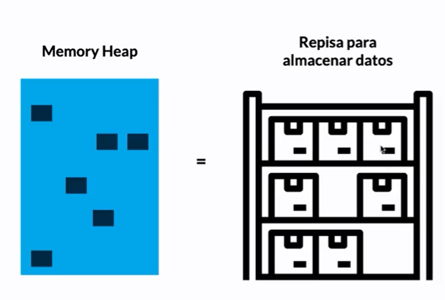
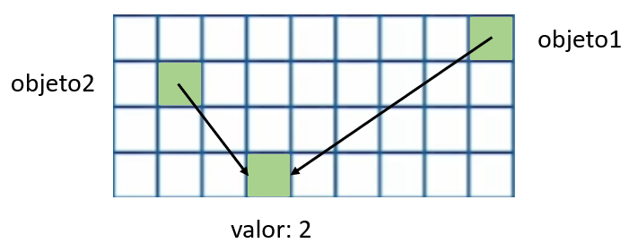

# Memory Heap

**El comportamiento de javascript es sincrono es decir, solamente puede ejecutar una tarea a la vez. Esto puede ser beneficioso y perjudicial dependiendo los casos. Por ende para ejecutar cada tarea, javascript, se organiza en dos estructuras de datos: el memory heap y el call stack.**

## Que es Memory Heap.

**Consiste en una manera desorganizada o aleatoria de guardar la informacion, ya sea en valores, funciones, entre otros. La RAM es donde se guardara esta informacion mediante una referncia o direccion.**

**Por ejemplo, declaras una variable (nombre) y le asignas un valor, esta se guardara en la memoria RAM utilizando una referencia que manejara el memory heap. De esta manera el Engine sabra que variable ejecutar despues de la declaracion, pidiendo a la referncia en memoria el memory heap y buscandola en la memoria RAM.**



## Valores por referencia.

**¿Que pasa con estructuras mas complejas como arrays u objetos?. Pues que estas se guardan en una direccion de moria diferente a sus valores, pero referenciadas entre si.**

```javascript
const obj1 = {
	valor: 1
};

const obj2 = obj1;
obj.valor = 2;

console.log(obj1.valor); // 2

console.log(obj1 === obj2); // true
```

**Primero se mostrara el valor 2 y depues true. La explicacccion es que la refencia de ambos obejtos es la misma a sus valores, por lo que si modifias un valor , tambien lo haras en cambios.**

