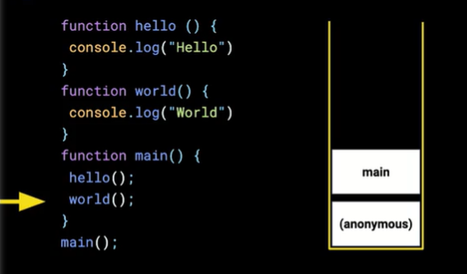

# Que es Call Stack

**El call stack consiste en ordenar las funciones que son invocadas de arriba hacia abajo, donde la ultima tarea sera la que ejecute primero. Una vez que se ha guardado la informacion del arhivo o programa, es momento de ejecutarlas.**

**Primeramente guarda todas las funciones o declaraciones en anonymous que representa el objeto global.**

**Y asi sucesivamente va agregando y quitando ejecuciones en el orden correspondiente. Es por eso que javascript realiza una tarea a la vez.**

## Ejemplo de ejecucion:

**El siguiente codigo contiene tres funciones (hello), (world) y (main) que han sido guardadas en el memory heap al declararlas y estan listas para ejecutarse.**

**Al llegar a la función (main), el Engine lo coloca en el Call Stack para ejecutarlo. Pero dentro se encuentran más invocaciones a otras funciones, por ende, primero ejecutará la que esté más arriba hasta ejecutarlas todas.**

**Al invocar la función (hello), el Engine lo coloca en el Call Stack. La función (console.log) también es una función, por lo que el Engine también lo colocará en el Call Stack.**

**Una vez ejecutada la función (console.log) el Engine lo sacará del Call Stack.**

**Como la función hello ya ha sido ejecutada, el Engine lo sacará del Call Stack para seguir ejecutando la función main.**

**Y así sucesivamente, hasta que termine de ejecutarse main, o todas las tareas en el Call Stack. Cuando no existan tareas en el Call Stack, el programa habrá finalizado.**