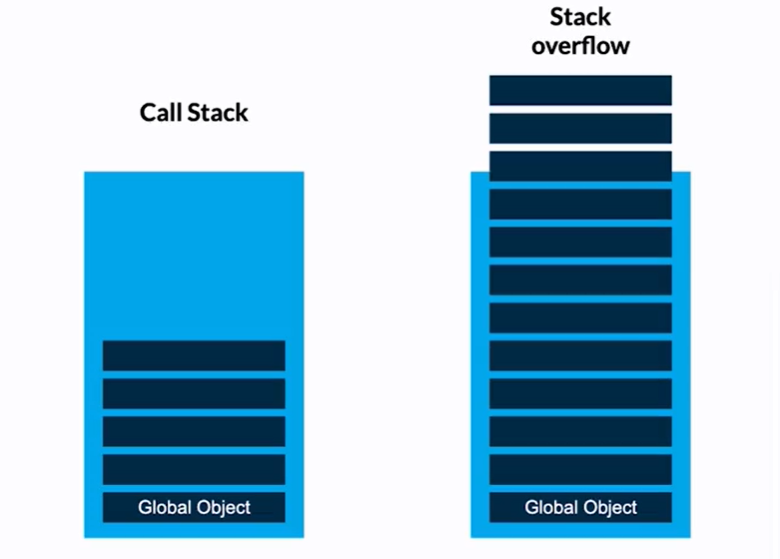
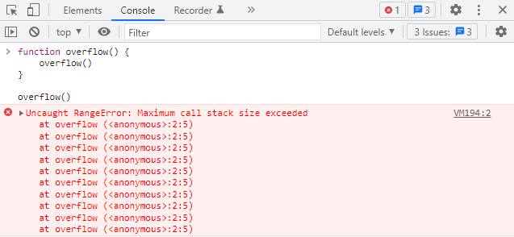

# Que es el Stack OverFlow

**Es un termino empleado para referirse al desboradmiento de tareas en el call stack del motor de javascript. Esto ocurre por ciclos infinitos, funciones recursivas sin control, cambios de estado continuo, o algun programa que exceda las tareas que puede ejecutar el navegador.**

**Anteriormente los navegadores no estaban preparados para manejar el Stack OverFlow por lo que la pagina colapsaba y se cerraba la aplicacion.**

